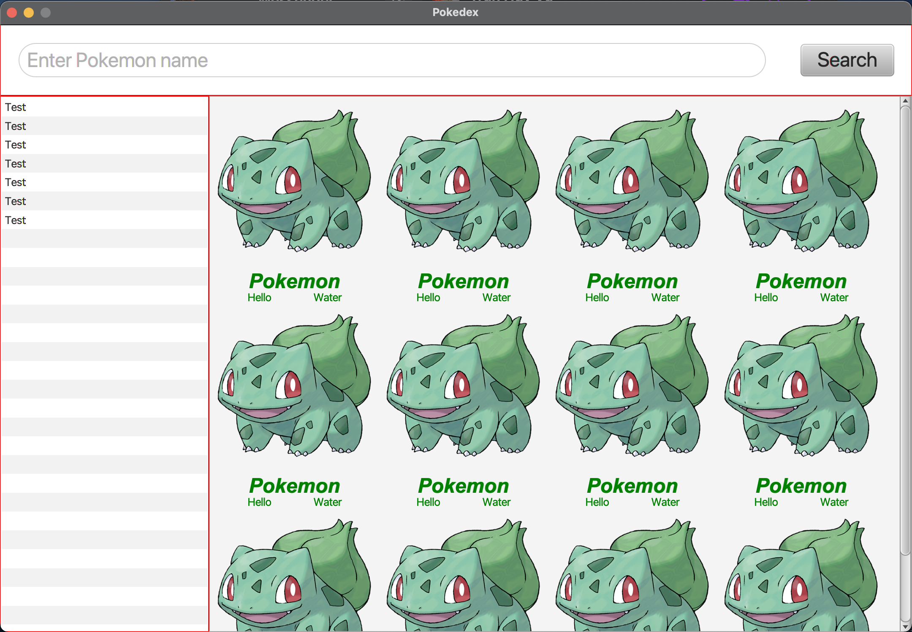

## Pokedex
- This repository store code about Pokedex application using in representation of Java class @UIT
- Using gradle to manage third party dependency

```shell
$ git clone https://github.com/sonlhcsuit/pokedex-jfx.git
$ cd pokedex-jfx
$ gradle build
$ gradle run
```


I remove this becasue too slow, I couldn't find any way to accurate download speed when dealing with third-party api.


And I switch into this one.  


Checkout youtube video: https://youtu.be/2eX27xVOASw